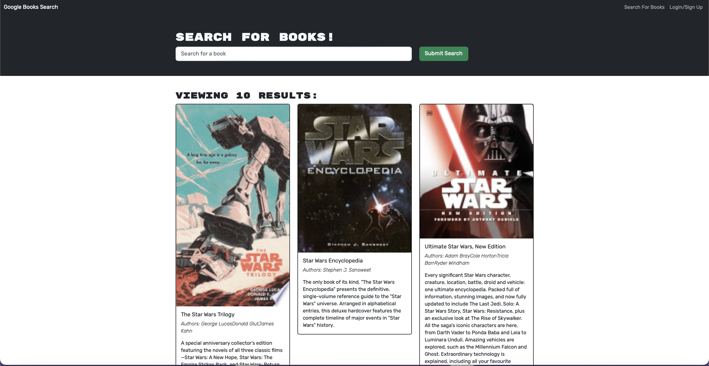

# Book Search Engine

## Technology Used

## Description

A simple MERN Book Search website where users can sign up to create an account, search and save books to their profile. The code originally used a RESTful API and then was refactored to use GraphQL API built with Apollo Server. 

## Table of Contents
* [Installation](#installation)
* [Usage](#usage)
* [Credits](#credits)
* [License](#license)
* [Github](#github)
* [DeployedApp](#deployed-application)
## Installation
Fallow these simple instructions:
1. Clone or fork the repo 
2. Set up MongoDB Compass to run MongoDB locally.
2. In the terminal run `npm i` then `npm run start`
3. Go to `http://localhost:3000`

## Screenshot of application

## Usage
This application is deployed to heroku.

## Credits

GitHub co-pilot was used to help speed up my code and to reduce errors. I also had assistance from a Edx's tutoring session. Starter code was provided by Edx's instructional team.

## License

This application is covered under the MIT License.
[License URL](https://opensource.org/licenses/MIT)

## Github

[https://github.com/sthogue](https://github.com/sthogue/)

[Professional Profile](https://www.stephenhogue.com)

## Deployed Application

[Link to deployed application](https://obscure-shore-02672-856c1e9a1859.herokuapp.com)